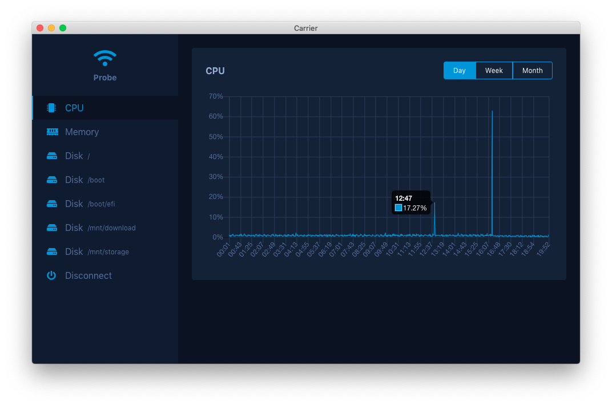

# Carrier

[](https://travis-ci.com/petaki/carrier)
[](https://opensource.org/licenses/MIT)

A minimalist Electron based dashboard for probes.



## Getting Started

Before you start, you need to install the prerequisites.

### Prerequisites

- Node.js: `Version >= 10.0` for building
- Yarn or NPM: for building

### Install from source

Currently, you can only install from source.

#### 1. Clone the repository:

```
git clone git@github.com:petaki/carrier.git
```

#### 2. Open the folder:

```
cd carrier
```

#### 3. Install the dependencies

```
yarn install
```

#### 4. Build the Carrier:

```
yarn build && yarn build-res
```

#### 5. Start the Carrier:

```
yarn start
```

## Data collection

You can gather the necessary data with the [Probe](https://github.com/petaki/probe).

## License

The Carrier is open-sourced software licensed under the [MIT license](http://opensource.org/licenses/MIT).
